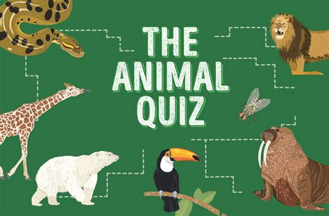

Are you a fan of quizzes? Would you like to make one yourself? In this project, you’ll build an animal quiz. Even though the questions are about animals, this project can be easily modified to be about any other topic.

In this example, you'll see bits of code with annotations. The code in black is new code to be added. The code in grey is existing code; use this to work out where to add the new lines of code. The instructions will ask you to run the code at various points. Make sure you do this and that the code successfully runs. **Do not proceed to the next step until the previous one works. You'll just make things harder for yourself!**

## What happens 
The program asks the player some questions about animals. They get three chances to answer each question—you don’t want to make the quiz too difficult! Each correct answer will score one point. At the end of the quiz, the program reveals the player’s final score.

## How it works 
This project makes use of a function—a block of code with a name that performs a specific task. A function lets you use the same code repeatedly, without having to type it all in every time. Python has lots of built-in functions, but it also lets you create functions of your own.

<div class="mxgraph" style="max-width:100%;border:1px solid transparent;" data-mxgraph="{&quot;highlight&quot;:&quot;#0000ff&quot;,&quot;nav&quot;:true,&quot;zoom&quot;:0.5,&quot;resize&quot;:true,&quot;toolbar&quot;:&quot;zoom layers tags lightbox&quot;,&quot;edit&quot;:&quot;_blank&quot;,&quot;xml&quot;:&quot;&lt;mxfile host=\&quot;app.diagrams.net\&quot; modified=\&quot;2023-04-12T00:56:08.854Z\&quot; agent=\&quot;Mozilla/5.0 (Macintosh; Intel Mac OS X 10_15_7) AppleWebKit/605.1.15 (KHTML, like Gecko) Version/16.3 Safari/605.1.15\&quot; etag=\&quot;87fVbyp06NgR4QSGzonn\&quot; version=\&quot;21.1.5\&quot;&gt;\n  &lt;diagram id=\&quot;p1AgiMrpuAm8F1ZPscJE\&quot; name=\&quot;Page-1\&quot;&gt;\n    &lt;mxGraphModel dx=\&quot;1012\&quot; dy=\&quot;788\&quot; grid=\&quot;1\&quot; gridSize=\&quot;10\&quot; guides=\&quot;1\&quot; tooltips=\&quot;1\&quot; connect=\&quot;1\&quot; arrows=\&quot;1\&quot; fold=\&quot;1\&quot; page=\&quot;1\&quot; pageScale=\&quot;1\&quot; pageWidth=\&quot;827\&quot; pageHeight=\&quot;1169\&quot; background=\&quot;none\&quot; math=\&quot;0\&quot; shadow=\&quot;0\&quot;&gt;\n      &lt;root&gt;\n        &lt;mxCell id=\&quot;0\&quot; /&gt;\n        &lt;mxCell id=\&quot;1\&quot; parent=\&quot;0\&quot; /&gt;\n        &lt;mxCell id=\&quot;Bg7bdpe4EZCknavDFSbw-3\&quot; style=\&quot;edgeStyle=orthogonalEdgeStyle;rounded=0;orthogonalLoop=1;jettySize=auto;html=1;entryX=0.5;entryY=0;entryDx=0;entryDy=0;fontFamily=Atkinson Hyperlegible;fontSource=https%3A%2F%2Ffonts.googleapis.com%2Fcss%3Ffamily%3DAtkinson%2BHyperlegible;fontSize=16;\&quot; parent=\&quot;1\&quot; source=\&quot;Bg7bdpe4EZCknavDFSbw-1\&quot; target=\&quot;Bg7bdpe4EZCknavDFSbw-2\&quot; edge=\&quot;1\&quot;&gt;\n          &lt;mxGeometry relative=\&quot;1\&quot; as=\&quot;geometry\&quot; /&gt;\n        &lt;/mxCell&gt;\n        &lt;mxCell id=\&quot;Bg7bdpe4EZCknavDFSbw-1\&quot; value=\&quot;Start\&quot; style=\&quot;ellipse;whiteSpace=wrap;html=1;rounded=0;fontFamily=Atkinson Hyperlegible;fontSource=https%3A%2F%2Ffonts.googleapis.com%2Fcss%3Ffamily%3DAtkinson%2BHyperlegible;fontSize=16;\&quot; parent=\&quot;1\&quot; vertex=\&quot;1\&quot;&gt;\n          &lt;mxGeometry x=\&quot;80\&quot; y=\&quot;80\&quot; width=\&quot;160\&quot; height=\&quot;40\&quot; as=\&quot;geometry\&quot; /&gt;\n        &lt;/mxCell&gt;\n        &lt;mxCell id=\&quot;1xneOEK4SibGXWCKyNLZ-8\&quot; style=\&quot;edgeStyle=orthogonalEdgeStyle;rounded=0;orthogonalLoop=1;jettySize=auto;html=1;\&quot; edge=\&quot;1\&quot; parent=\&quot;1\&quot; source=\&quot;Bg7bdpe4EZCknavDFSbw-2\&quot; target=\&quot;1xneOEK4SibGXWCKyNLZ-2\&quot;&gt;\n          &lt;mxGeometry relative=\&quot;1\&quot; as=\&quot;geometry\&quot; /&gt;\n        &lt;/mxCell&gt;\n        &lt;mxCell id=\&quot;Bg7bdpe4EZCknavDFSbw-2\&quot; value=\&quot;Set score to 0\&quot; style=\&quot;rounded=0;whiteSpace=wrap;html=1;fontFamily=Atkinson Hyperlegible;fontSource=https%3A%2F%2Ffonts.googleapis.com%2Fcss%3Ffamily%3DAtkinson%2BHyperlegible;fontSize=16;\&quot; parent=\&quot;1\&quot; vertex=\&quot;1\&quot;&gt;\n          &lt;mxGeometry x=\&quot;80\&quot; y=\&quot;160\&quot; width=\&quot;160\&quot; height=\&quot;40\&quot; as=\&quot;geometry\&quot; /&gt;\n        &lt;/mxCell&gt;\n        &lt;mxCell id=\&quot;1xneOEK4SibGXWCKyNLZ-9\&quot; style=\&quot;edgeStyle=orthogonalEdgeStyle;rounded=0;orthogonalLoop=1;jettySize=auto;html=1;entryX=0.5;entryY=0;entryDx=0;entryDy=0;\&quot; edge=\&quot;1\&quot; parent=\&quot;1\&quot; source=\&quot;1xneOEK4SibGXWCKyNLZ-2\&quot; target=\&quot;1xneOEK4SibGXWCKyNLZ-3\&quot;&gt;\n          &lt;mxGeometry relative=\&quot;1\&quot; as=\&quot;geometry\&quot; /&gt;\n        &lt;/mxCell&gt;\n        &lt;mxCell id=\&quot;1xneOEK4SibGXWCKyNLZ-2\&quot; value=\&quot;Display &amp;quot;Guess the Animal!&amp;quot;\&quot; style=\&quot;rounded=0;whiteSpace=wrap;html=1;fontFamily=Atkinson Hyperlegible;fontSource=https%3A%2F%2Ffonts.googleapis.com%2Fcss%3Ffamily%3DAtkinson%2BHyperlegible;fontSize=16;\&quot; vertex=\&quot;1\&quot; parent=\&quot;1\&quot;&gt;\n          &lt;mxGeometry x=\&quot;80\&quot; y=\&quot;240\&quot; width=\&quot;160\&quot; height=\&quot;40\&quot; as=\&quot;geometry\&quot; /&gt;\n        &lt;/mxCell&gt;\n        &lt;mxCell id=\&quot;1xneOEK4SibGXWCKyNLZ-10\&quot; style=\&quot;edgeStyle=orthogonalEdgeStyle;rounded=0;orthogonalLoop=1;jettySize=auto;html=1;\&quot; edge=\&quot;1\&quot; parent=\&quot;1\&quot; source=\&quot;1xneOEK4SibGXWCKyNLZ-3\&quot; target=\&quot;1xneOEK4SibGXWCKyNLZ-4\&quot;&gt;\n          &lt;mxGeometry relative=\&quot;1\&quot; as=\&quot;geometry\&quot; /&gt;\n        &lt;/mxCell&gt;\n        &lt;mxCell id=\&quot;1xneOEK4SibGXWCKyNLZ-3\&quot; value=\&quot;Ask question and get user&amp;#39;s answer\&quot; style=\&quot;rounded=0;whiteSpace=wrap;html=1;fontFamily=Atkinson Hyperlegible;fontSource=https%3A%2F%2Ffonts.googleapis.com%2Fcss%3Ffamily%3DAtkinson%2BHyperlegible;fontSize=16;\&quot; vertex=\&quot;1\&quot; parent=\&quot;1\&quot;&gt;\n          &lt;mxGeometry x=\&quot;80\&quot; y=\&quot;320\&quot; width=\&quot;160\&quot; height=\&quot;40\&quot; as=\&quot;geometry\&quot; /&gt;\n        &lt;/mxCell&gt;\n        &lt;mxCell id=\&quot;1xneOEK4SibGXWCKyNLZ-11\&quot; style=\&quot;edgeStyle=orthogonalEdgeStyle;rounded=0;orthogonalLoop=1;jettySize=auto;html=1;\&quot; edge=\&quot;1\&quot; parent=\&quot;1\&quot; source=\&quot;1xneOEK4SibGXWCKyNLZ-4\&quot; target=\&quot;1xneOEK4SibGXWCKyNLZ-5\&quot;&gt;\n          &lt;mxGeometry relative=\&quot;1\&quot; as=\&quot;geometry\&quot; /&gt;\n        &lt;/mxCell&gt;\n        &lt;mxCell id=\&quot;1xneOEK4SibGXWCKyNLZ-4\&quot; value=\&quot;Check answer\&quot; style=\&quot;rounded=0;whiteSpace=wrap;html=1;fontFamily=Atkinson Hyperlegible;fontSource=https%3A%2F%2Ffonts.googleapis.com%2Fcss%3Ffamily%3DAtkinson%2BHyperlegible;fontSize=16;\&quot; vertex=\&quot;1\&quot; parent=\&quot;1\&quot;&gt;\n          &lt;mxGeometry x=\&quot;80\&quot; y=\&quot;400\&quot; width=\&quot;160\&quot; height=\&quot;40\&quot; as=\&quot;geometry\&quot; /&gt;\n        &lt;/mxCell&gt;\n        &lt;mxCell id=\&quot;1xneOEK4SibGXWCKyNLZ-12\&quot; value=\&quot;yes\&quot; style=\&quot;edgeStyle=orthogonalEdgeStyle;rounded=0;orthogonalLoop=1;jettySize=auto;html=1;entryX=0.5;entryY=0;entryDx=0;entryDy=0;\&quot; edge=\&quot;1\&quot; parent=\&quot;1\&quot; source=\&quot;1xneOEK4SibGXWCKyNLZ-5\&quot; target=\&quot;1xneOEK4SibGXWCKyNLZ-6\&quot;&gt;\n          &lt;mxGeometry x=\&quot;-0.5\&quot; y=\&quot;10\&quot; relative=\&quot;1\&quot; as=\&quot;geometry\&quot;&gt;\n            &lt;mxPoint as=\&quot;offset\&quot; /&gt;\n          &lt;/mxGeometry&gt;\n        &lt;/mxCell&gt;\n        &lt;mxCell id=\&quot;1xneOEK4SibGXWCKyNLZ-21\&quot; value=\&quot;no\&quot; style=\&quot;edgeStyle=orthogonalEdgeStyle;rounded=0;orthogonalLoop=1;jettySize=auto;html=1;entryX=0;entryY=0.5;entryDx=0;entryDy=0;\&quot; edge=\&quot;1\&quot; parent=\&quot;1\&quot; source=\&quot;1xneOEK4SibGXWCKyNLZ-5\&quot; target=\&quot;1xneOEK4SibGXWCKyNLZ-20\&quot;&gt;\n          &lt;mxGeometry y=\&quot;10\&quot; relative=\&quot;1\&quot; as=\&quot;geometry\&quot;&gt;\n            &lt;mxPoint as=\&quot;offset\&quot; /&gt;\n          &lt;/mxGeometry&gt;\n        &lt;/mxCell&gt;\n        &lt;mxCell id=\&quot;1xneOEK4SibGXWCKyNLZ-5\&quot; value=\&quot;Is answer correct?\&quot; style=\&quot;rhombus;whiteSpace=wrap;html=1;fontFamily=Atkinson Hyperlegible;fontSource=https%3A%2F%2Ffonts.googleapis.com%2Fcss%3Ffamily%3DAtkinson%2BHyperlegible;fontSize=16;rounded=0;\&quot; vertex=\&quot;1\&quot; parent=\&quot;1\&quot;&gt;\n          &lt;mxGeometry x=\&quot;80\&quot; y=\&quot;480\&quot; width=\&quot;160\&quot; height=\&quot;80\&quot; as=\&quot;geometry\&quot; /&gt;\n        &lt;/mxCell&gt;\n        &lt;mxCell id=\&quot;1xneOEK4SibGXWCKyNLZ-13\&quot; style=\&quot;edgeStyle=orthogonalEdgeStyle;rounded=0;orthogonalLoop=1;jettySize=auto;html=1;\&quot; edge=\&quot;1\&quot; parent=\&quot;1\&quot; source=\&quot;1xneOEK4SibGXWCKyNLZ-6\&quot; target=\&quot;1xneOEK4SibGXWCKyNLZ-7\&quot;&gt;\n          &lt;mxGeometry relative=\&quot;1\&quot; as=\&quot;geometry\&quot; /&gt;\n        &lt;/mxCell&gt;\n        &lt;mxCell id=\&quot;1xneOEK4SibGXWCKyNLZ-6\&quot; value=\&quot;Add 1 to score\&quot; style=\&quot;rounded=0;whiteSpace=wrap;html=1;fontFamily=Atkinson Hyperlegible;fontSource=https%3A%2F%2Ffonts.googleapis.com%2Fcss%3Ffamily%3DAtkinson%2BHyperlegible;fontSize=16;\&quot; vertex=\&quot;1\&quot; parent=\&quot;1\&quot;&gt;\n          &lt;mxGeometry x=\&quot;80\&quot; y=\&quot;600\&quot; width=\&quot;160\&quot; height=\&quot;40\&quot; as=\&quot;geometry\&quot; /&gt;\n        &lt;/mxCell&gt;\n        &lt;mxCell id=\&quot;1xneOEK4SibGXWCKyNLZ-14\&quot; value=\&quot;yes\&quot; style=\&quot;edgeStyle=orthogonalEdgeStyle;rounded=0;orthogonalLoop=1;jettySize=auto;html=1;\&quot; edge=\&quot;1\&quot; parent=\&quot;1\&quot; source=\&quot;1xneOEK4SibGXWCKyNLZ-7\&quot;&gt;\n          &lt;mxGeometry x=\&quot;-0.8889\&quot; y=\&quot;-10\&quot; relative=\&quot;1\&quot; as=\&quot;geometry\&quot;&gt;\n            &lt;mxPoint x=\&quot;160\&quot; y=\&quot;300\&quot; as=\&quot;targetPoint\&quot; /&gt;\n            &lt;Array as=\&quot;points\&quot;&gt;\n              &lt;mxPoint x=\&quot;60\&quot; y=\&quot;720\&quot; /&gt;\n              &lt;mxPoint x=\&quot;60\&quot; y=\&quot;300\&quot; /&gt;\n            &lt;/Array&gt;\n            &lt;mxPoint as=\&quot;offset\&quot; /&gt;\n          &lt;/mxGeometry&gt;\n        &lt;/mxCell&gt;\n        &lt;mxCell id=\&quot;1xneOEK4SibGXWCKyNLZ-18\&quot; value=\&quot;no\&quot; style=\&quot;edgeStyle=orthogonalEdgeStyle;rounded=0;orthogonalLoop=1;jettySize=auto;html=1;entryX=0.5;entryY=0;entryDx=0;entryDy=0;\&quot; edge=\&quot;1\&quot; parent=\&quot;1\&quot; source=\&quot;1xneOEK4SibGXWCKyNLZ-7\&quot; target=\&quot;1xneOEK4SibGXWCKyNLZ-15\&quot;&gt;\n          &lt;mxGeometry x=\&quot;-0.5\&quot; y=\&quot;10\&quot; relative=\&quot;1\&quot; as=\&quot;geometry\&quot;&gt;\n            &lt;mxPoint as=\&quot;offset\&quot; /&gt;\n          &lt;/mxGeometry&gt;\n        &lt;/mxCell&gt;\n        &lt;mxCell id=\&quot;1xneOEK4SibGXWCKyNLZ-7\&quot; value=\&quot;Are there more questions?\&quot; style=\&quot;rhombus;whiteSpace=wrap;html=1;fontFamily=Atkinson Hyperlegible;fontSource=https%3A%2F%2Ffonts.googleapis.com%2Fcss%3Ffamily%3DAtkinson%2BHyperlegible;fontSize=16;rounded=0;\&quot; vertex=\&quot;1\&quot; parent=\&quot;1\&quot;&gt;\n          &lt;mxGeometry x=\&quot;80\&quot; y=\&quot;680\&quot; width=\&quot;160\&quot; height=\&quot;80\&quot; as=\&quot;geometry\&quot; /&gt;\n        &lt;/mxCell&gt;\n        &lt;mxCell id=\&quot;1xneOEK4SibGXWCKyNLZ-19\&quot; style=\&quot;edgeStyle=orthogonalEdgeStyle;rounded=0;orthogonalLoop=1;jettySize=auto;html=1;\&quot; edge=\&quot;1\&quot; parent=\&quot;1\&quot; source=\&quot;1xneOEK4SibGXWCKyNLZ-15\&quot; target=\&quot;1xneOEK4SibGXWCKyNLZ-17\&quot;&gt;\n          &lt;mxGeometry relative=\&quot;1\&quot; as=\&quot;geometry\&quot; /&gt;\n        &lt;/mxCell&gt;\n        &lt;mxCell id=\&quot;1xneOEK4SibGXWCKyNLZ-15\&quot; value=\&quot;Add 1 to score\&quot; style=\&quot;rounded=0;whiteSpace=wrap;html=1;fontFamily=Atkinson Hyperlegible;fontSource=https%3A%2F%2Ffonts.googleapis.com%2Fcss%3Ffamily%3DAtkinson%2BHyperlegible;fontSize=16;\&quot; vertex=\&quot;1\&quot; parent=\&quot;1\&quot;&gt;\n          &lt;mxGeometry x=\&quot;80\&quot; y=\&quot;800\&quot; width=\&quot;160\&quot; height=\&quot;40\&quot; as=\&quot;geometry\&quot; /&gt;\n        &lt;/mxCell&gt;\n        &lt;mxCell id=\&quot;1xneOEK4SibGXWCKyNLZ-17\&quot; value=\&quot;End\&quot; style=\&quot;ellipse;whiteSpace=wrap;html=1;rounded=0;fontFamily=Atkinson Hyperlegible;fontSource=https%3A%2F%2Ffonts.googleapis.com%2Fcss%3Ffamily%3DAtkinson%2BHyperlegible;fontSize=16;\&quot; vertex=\&quot;1\&quot; parent=\&quot;1\&quot;&gt;\n          &lt;mxGeometry x=\&quot;80\&quot; y=\&quot;880\&quot; width=\&quot;160\&quot; height=\&quot;40\&quot; as=\&quot;geometry\&quot; /&gt;\n        &lt;/mxCell&gt;\n        &lt;mxCell id=\&quot;1xneOEK4SibGXWCKyNLZ-22\&quot; value=\&quot;yes\&quot; style=\&quot;edgeStyle=orthogonalEdgeStyle;rounded=0;orthogonalLoop=1;jettySize=auto;html=1;\&quot; edge=\&quot;1\&quot; parent=\&quot;1\&quot; source=\&quot;1xneOEK4SibGXWCKyNLZ-20\&quot;&gt;\n          &lt;mxGeometry x=\&quot;-0.9231\&quot; y=\&quot;-10\&quot; relative=\&quot;1\&quot; as=\&quot;geometry\&quot;&gt;\n            &lt;mxPoint x=\&quot;160\&quot; y=\&quot;300\&quot; as=\&quot;targetPoint\&quot; /&gt;\n            &lt;Array as=\&quot;points\&quot;&gt;\n              &lt;mxPoint x=\&quot;360\&quot; y=\&quot;300\&quot; /&gt;\n              &lt;mxPoint x=\&quot;240\&quot; y=\&quot;300\&quot; /&gt;\n            &lt;/Array&gt;\n            &lt;mxPoint as=\&quot;offset\&quot; /&gt;\n          &lt;/mxGeometry&gt;\n        &lt;/mxCell&gt;\n        &lt;mxCell id=\&quot;1xneOEK4SibGXWCKyNLZ-23\&quot; value=\&quot;no\&quot; style=\&quot;edgeStyle=orthogonalEdgeStyle;rounded=0;orthogonalLoop=1;jettySize=auto;html=1;\&quot; edge=\&quot;1\&quot; parent=\&quot;1\&quot; source=\&quot;1xneOEK4SibGXWCKyNLZ-20\&quot;&gt;\n          &lt;mxGeometry x=\&quot;-0.9333\&quot; y=\&quot;10\&quot; relative=\&quot;1\&quot; as=\&quot;geometry\&quot;&gt;\n            &lt;mxPoint x=\&quot;160\&quot; y=\&quot;660\&quot; as=\&quot;targetPoint\&quot; /&gt;\n            &lt;Array as=\&quot;points\&quot;&gt;\n              &lt;mxPoint x=\&quot;360\&quot; y=\&quot;660\&quot; /&gt;\n            &lt;/Array&gt;\n            &lt;mxPoint as=\&quot;offset\&quot; /&gt;\n          &lt;/mxGeometry&gt;\n        &lt;/mxCell&gt;\n        &lt;mxCell id=\&quot;1xneOEK4SibGXWCKyNLZ-20\&quot; value=\&quot;Are there any&amp;lt;br&amp;gt;chances left?\&quot; style=\&quot;rhombus;whiteSpace=wrap;html=1;fontFamily=Atkinson Hyperlegible;fontSource=https%3A%2F%2Ffonts.googleapis.com%2Fcss%3Ffamily%3DAtkinson%2BHyperlegible;fontSize=16;rounded=0;\&quot; vertex=\&quot;1\&quot; parent=\&quot;1\&quot;&gt;\n          &lt;mxGeometry x=\&quot;280\&quot; y=\&quot;480\&quot; width=\&quot;160\&quot; height=\&quot;80\&quot; as=\&quot;geometry\&quot; /&gt;\n        &lt;/mxCell&gt;\n      &lt;/root&gt;\n    &lt;/mxGraphModel&gt;\n  &lt;/diagram&gt;\n&lt;/mxfile&gt;\n&quot;}"></div>
<script type="text/javascript" src="https://viewer.diagrams.net/js/viewer-static.min.js"></script>


## Putting it together
It’s now time to build your quiz! First you’ll create the questions and the mechanism for checking the answers. Then you’ll add the code that gives the player three attempts to answer each question.

## 1. Create A New File
Open Mu Editor. Make sure the editor is in the right mode. Click the **Mode** button in the top left, and choose **Python 3**. Create a new file, and save it with the name `animalQuiz.py` in your Digital Tech folder, in a folder named `quiz`.

## 2. Create the score variable 
Type in the code shown here to create a variable called `score` and set its starting value to `0`.

```python
score = 0
```

## 3. Introduce the game
Next, create a message to introduce the game to the player. This will be the first thing that the player sees on the screen.

```python{hl_lines=2}
score = 0
print('Guess the animal')
```

## 4. Run the code
Now try running the code. Press the Run button from the bar at the top. What happens next? You should see the welcome message in the interactive panel at the bottom of the window. Press the Stop button (where the Run button was) to stop the program and return to editing.

## 5. Ask a question (user input) 
The next line of code asks a question and waits for the player’s response. The answer (the user input) is saved in the variable `guess1`. Run the code to make sure the question appears.

```python{hl_lines=2}
print('Guess the animal')
guess1 = input('Which bear lives at the North Pole? ')
```

## 6. Build a check function 
The next task is to check if the player’s guess is correct. Type this code at the top of your script, before `score = 0`. The code creates a function, called `check_guess()`, that will check if the player’s guess matches the correct answer. The two words in brackets are **[parameters]()**—bits of information the function needs. When you call (run) a function, you assign (give) values, known as **[arguments]()**, to its parameters.

```python{hl_lines=["1-6"]}
def check_guess(guess, answer):
    global score
    if guess == answer:
        print('Correct answer')
        score = score + 1

score = 0
```

## 7. Call the function 
Now add a line at the end of the script to call (run) the check_guess() function. This code tells the function to use the player’s guess as the first parameter and the phrase “polar bear” as the second parameter.

```python{hl_lines=2}
guess1 = input('Which bear lives at the North Pole? ')
check_guess(guess1, 'polar bear')
```

## 8. Test the code 
Try running the code again and type in the correct answer. The shell window should look like this.

```
Guess the Animal!
Which bear lives at the North Pole? polar bear
Correct answer
```

## 9. Add some more questions
It takes more than one question to make a quiz! Add two more questions to the program, following the same steps as before. We’ll store the player’s answers in the variables `guess2` and `guess3`.

```python{hl_lines=["3-6"]}
guess1 = input('Which bear lives at the North Pole? ')
check_guess(guess1, 'polar bear')
guess2 = input('Which is the fastest land animal? ')
check_guess(guess1, 'cheetah')
guess3 = input('Which is the largest animal? ')
check_guess(guess1, 'blue whale')
```

## 10. Display the score
The next line of code will reveal the player’s score in a message when the quiz ends. Add it to the bottom of the file, under the last question.

```python{hl_lines=["3-4"]}
guess3 = input('Which is the largest animal? ')
check_guess(guess1, 'blue whale')

print(f'Your score is {str(score)}')
```

## 11. Ignore case
What happens if the player types “Lion” instead of “lion”? Will they still get a point? No, the code will tell them it’s the wrong answer! To fix this, you need to make your code smarter. Python has a `lower()` function, which changes words into all lower-case characters. In your code, replace `if guess == answer:` with the line shown on the right in bold.

```python{hl_lines=["3"]}
def check_guess(guess, answer):
    global score
    if guess.lower() == answer.lower():
        print('Correct answer')
        score = score + 1
```

## 12. Test the code again
Run your code for a third time. Try typing the correct answers using a mixture of capitals and lower-case letters and see what happens.

```
Guess the Animal!
Which bear lives at the North Pole? polar bear
Correct answer
Which is the fastest land animal? Cheetah
Correct answer
Which is the largest animal? BLUE WHALE
Correct answer
Your score is 3
```

## 13. Give the player more chances
 
The player currently has only one chance 
to get the answer right. You can make it 
a bit easier for them by giving them three 
chances to answer a question. Change the 
`check_guess()` function to look like this.

```python{hl_lines=["3-16"]}
def check_guess(guess, answer):
    global score 
    still_guessing = True 
    attempt = 0
    
    while still_guessing and attempt < 3:
        if guess.lower() == answer.lower():
            print('Correct answer')
            score = score + 1 
            still_guessing = False
        else:
            if attempt < 2:
                guess = input('Sorry wrong answer. Try again. ')
            attempt = attempt + 1
    if attempt == 3:
        print(f'The correct answer is "{answer}"')

score = 0
```

To know if the player has gotten the 
right answer, you need to create a 
variable called `still_guessing`. 
You then set the variable to True
to show that the right answer hasn’t 
been found. It’s set to False when the 
player gets the right answer.
