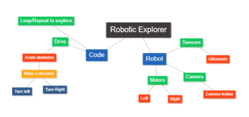
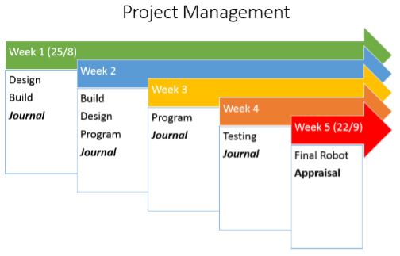

- [Submission template](RoboticsExplorer.pptx)


As a mining company, we are seeking a solution for carrying out tasks in hazardous areas of our mines without risking the safety of our workers. We are interested in an autonomous robot that can navigate through confined spaces and avoid obstacles, such as rocks or machinery. It should also have the ability to carry a small camera or mobile phone. Could your team design and program such a robot for us?


---
**In teams of two**, your task is to design and program an autonomous robot that can explore and navigate its way around a room by avoiding walls and other obstacles before running into them. Your robot must have the capacity to carry a small camera or mobile phone.

## Defining
All projects need an introduction that tells the reader what the intended aim of the developed project will be. The problem definition explains the problem/situation and outlines the intended outcomes of the system.

- Explain the task by describing the scenario or setting in which the problem exists. Use the following template to describe the problem to be solved. As a *type of user*, I want *some goal* so that *some reason*. For example:
    > "As a user with a visual impairment I want to be able to get the news on my smartphone so that I can keep up with my world."
- List the design criteria required by the user <small><i>(AC9TDI8P04)</i></small>

### Decomposing
How can this problem be broken down into smaller parts so it can be solved? <small><i>(AC9TDI8P04)</i></small>
Make a list/diagram of the smaller parts that will together solve the problem.

## Collaborating and managing
Project planning is stating how to complete a project within a certain timeframe, usually with defined stages, and with designated resources. 
- Using the example table below to *plan* and *manage* the collaborative project. <small><i>(AC9TDI8P12)</i></small>
- Use the feedback notes to record:
    - Problems your team encountered and how your team solved the problems. 
    - Steps your team took to produce your final robot (use photos or video).
    - What aspects of your design and program you tested. 
    - What adjustments did you make to improve the robot build and program to complete the project
    - What did you learn?

### Project planning
Project Tasks/Stage|Responsibilities|Timeframes/Schedule Completion Date|Tested completed|Feedback Notes
---|---|---|---|---
 . | . | . | . | . 
 . | . | . | . | .

### Project Collaboration Protocols
Discuss how the project content will be shared and what collaboration protocols/rules your team has agreed to. 
- What digital tools will your team use to collaborate and why?
- What procedures will be followed to ensure work can continue in the event of a lost laptop or absent team member?
-How will you ensure your team’s work is presented consistently?

## Designing
Before your team creates and develops a robot to achieve the goal(s) described above you need to discuss and document a SPA.

### Sense — Plan — Act
SENSE
: The robot needs the ability to sense important things about its environment, like the presence of obstacles or navigation aids. What data does your robot need about its surroundings, and how will it gather that data? How Will you validate the data collected? <small><i>(AC9TDI8P01)</i></small>

PLAN
: The robot needs to take the sensed data and figure out how to respond appropriately to it, based on a pre-existing strategy. What is the robot's strategy? How does your program determine the appropriate response, based on that strategy and the sensed data? Draw a flowchart of your plan. <small><i>(AC9TDI8P05)</i></small>

ACT
: Finally, the robot must actually act to carry out the actions that the plan calls for. Will the robot design your team is planning to build allow it to sense and act out your plan, physically? What will the robot do? How will it act?

## Implementing
### Coding, modifying, debugging and testing
During the development and testing of your robot each team member is required to maintain the shared Project Plan. 
Collaboratively implement your solution to the problem by writing, modifying, debugging and testing your code as a team. (AC9TDI8P09)
Your code must include:
- Comments to explain sections of code.
- White space so it can be easily read.
- Control structures – Sequence, selection/branching and Iteration/loops

### Final Program
A print screen or print out of your final program is required with a detailed summary of how the program works. Make sure you have labelled the different sections of your program and have used internal comments. (AC9TDI8P09)

### Validation Video
Video your team’s robot solving the problem.

## Evaluating
### Evaluation (AC9TDI8P10)
In detail, describe the overall success or your robot. These questions will help you:
- Can your robot successfully achieve its primary goal? 
- Has your solution satisfied all the design criteria? Explain. 
- What does it do well? 
- What can be improved? 
- Is it efficient? Discuss the effectiveness of the code. 
- What other areas of society could you robot be used or opportunities for innovation and further development? 
- What future impact could your robot have?
- Are there any potential risks associated with your robot and what can be done to reduce them?
- Reflect on your project plan justifying choices made, identifying future improvements to plan and group team and task roles.

Presentation Checklist
Title slides
: ⬜ Team Members

Defining
: ⬜ Describe the problem.
: ⬜ List Design criteria.
: ⬜ Decompose the problem. 

Collaborating and managing
: ⬜ Plan and Manage evidence with feedback notes.
: ⬜ Project Collaboration Protocols with software used.

Designing
: ⬜ Sensors used and how will it act?
: ⬜ Flow Chart

Implementing
: ⬜ Final Program/Code with comments
: ⬜ Validation Video

Evaluation 
: ⬜ Detailed evaluation (answer questions)

---

## To Be Successful 
Your team must complete a working robot and documentation that includes:

- Defining
- Collaborating and managing
- Designing
- Implementing
- Evaluating

Include comments with your all Python code. Use appropriate programming structures (selection and iteration). In detail, you must each complete the documentation in your OneNote.

## Purpose
Students apply their coding skills and iterative project techniques to collaboratively identify, deconstruct, design and create an autonomous robot that uses sensors to explore a room.

## Learning Behaviours
This task provides the following opportunities to develop and demonstrate the Learner Behaviours:

Driven
: Engages in Python coding challenges with persistence and learns from their mistakes and willingly completes the extension activities.

Curious
: Explores and tests ideas by asking questions, researching and through trial and error when learning new skills or developing solutions

Collaborative
: Works in teams to solve problems and create new information. Willingly shares new skills and knowledge and assists others and seeks assistance from peers.

Connected
: Connects programming constructs and data structures to real life applications and is able to explore and discuss issues and ethical implications of their solution

Flexible Thinker
: Applies new knowledge and skills to solve problems and is able to adapt and recognize patterns in other solutions

Disciplined
: Motivated learner who demonstrates initiative by following a project management process to complete a project
