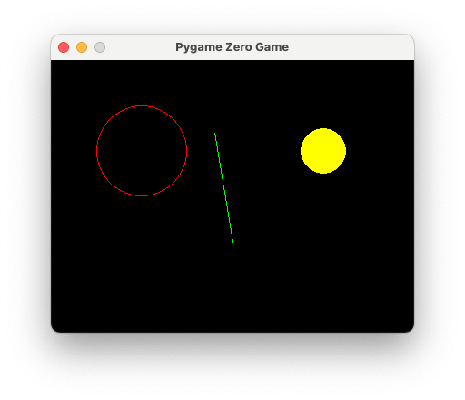

You can draw things by putting commands inside a function called `draw()`.

```python
WIDTH = 400
HEIGHT = 300

def draw():
    screen.draw.circle((100,100), 50, 'red')
    screen.draw.filled_circle((300,100), 25, 'yellow')
    screen.draw.line((200,200), (180, 80), 'green')
```

```math
\mathtt{screen.draw.circle(\colorbox{yellow}{(100,100)}, \colorbox{aquamarine}{50}, \colorbox{pink}{'red'})}
```

$$\mathtt{screen.draw.circle(\colorbox{yellow}{(100,100)}, \colorbox{aquamarine}{50}, \colorbox{pink}{'red'})$$


